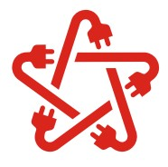

# MatKac.sp.j 𓀑

  

# Members:
    1.Magdalena Borowiec   - CEO - przewodnicząca 
    2.Mateusz Aniołkowski  - TL - one man army
    3.Oskar Wawrzyniak     - Erazmus 
    4.Grzegorz Grzenkowicz - Dostawca częsci
    5.Dennis Ahmed         - Senior Programmist
    6.Kacper Wróblewski    - ETO cadet
    7.Dawid Sanecki        - Ochrona Juventus

# Założenia projektu:
    - 3 tryby pracy (ograniczenie mocy i prędkosci)
    - oswietlenie drogowe
    - prędkościomierz
    - płynna regulacja prędkosci
    - system monitorowania i zabezpieczenia beterii
    - amperometryka silnika
    - kontrola temperatury na poszczególnych podzespołach
    
#  Rozplanowanie zadań
    PAZDZIERNIK
      >
      >
    LISTOPAD
      >
      >
    GRUDZIEN
      >
      >
    STYCZEN 
      >
      >
    LUTY
      >
      >

 